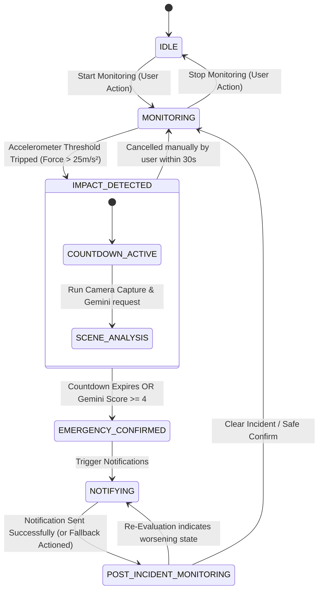

# ResQ System Architecture

This document outlines the detailed system architecture, data flow, state machine transitions, and modules for the **ResQ** emergency response agent.

---

## 1. Component Diagram

```
┌────────────────────────────────────────────────────────────────────────┐
│                              MOBILE APP                                │
│                                                                        │
│   ┌────────────────────┐   ┌────────────────────┐   ┌──────────────┐   │
│   │   Dashboard UI     │   │   Contact Config   │   │ Alert Modal  │   │
│   └─────────▲──────────┘   └─────────▲──────────┘   └──────▲───────┘   │
│             │                        │                     │           │
│             └────────────────────────┼─────────────────────┘           │
│                                      │                                 │
│                           ┌──────────▼──────────┐                      │
│                           │  Zustand Store      │                      │
│                           └──────────┬──────────┘                      │
└───┬──────────────────────────────────┼───────────────────────────▲─────┘
    │                                  │                           │
    │ 1. Start Sensors                 ▼ 3. State & Logs           │ 5. Trigger Action
    │                       ┌─────────────────────┐                │
    ├──────────────────────►│    AI Agent Core    ├────────────────┘
    │                       └──────────┬──────────┘
    │                                  │
    │ 2. Sensor & GPS Telemetry        │ 4. Request Analysis / Send Alert
    ▼                                  ▼
┌──────────────┐            ┌────────────────────────────────────────────┐
│ SENSOR LAYER │            │             SERVICES LAYER                 │
│              │            │                                            │
│ - Accel Hook │            │  ┌───────────────┐      ┌───────────────┐  │
│ - Camera Hook│            │  │ Gemini Vision │      │ Twilio / SMS  │  │
│ - GPS Hook   │            │  └───────┬───────┘      └───────┬───────┘  │
└──────────────┘            └──────────┼──────────────────────┼──────────┘
                                       ▼                      ▼
                            ┌───────────────────┐    ┌──────────────────┐
                            │ Google Gemini API │    │ Twilio Gateway / │
                            │ (1.5 Flash Model) │    │  Device Fallback │
                            └───────────────────┘    └──────────────────┘
```

---

## 2. Accident Detection Data Flow Pipeline

1. **Telemetry Feed**: The `useAccelerometer` hook registers a `devicemotion` listener. Every 16ms (approx 60Hz), it calculates the magnitude of the 3D acceleration vector:
   $$A = \sqrt{x^2 + y^2 + z^2}$$
2. **Impact Detection Trigger**: If $A > 25\text{ m/s}^2$ for consecutive samples spanning $>200\text{ms}$, the store's state shifts to `IMPACT_DETECTED`.
3. **Grace Period**: The `AlertCountdown` UI displays a 30-second cancellation timer and plays an warning alarm sound. Simultaneously, the camera service activates.
4. **Scene Capture**: The `useCamera` hook opens a media stream, grabs a frame, renders it to a hidden canvas, and converts it to a JPEG base64 string.
5. **AI Evaluation**: The `geminiService` sends the base64 frame along with current GPS coordinates and sensor magnitude to the Gemini 1.5 Flash model.
6. **Decision**:
   - If the user cancels: the state resets to `MONITORING`.
   - If Gemini returns a low confidence rating ($<4/10$) and the user cancels: state returns to `MONITORING`.
   - If the countdown runs out OR Gemini returns a high emergency score ($\ge 4/10$), the state shifts to `NOTIFYING`.
7. **Dispatch**: The `notificationService` fires an SMS via Twilio to emergency contacts. In case of API failure, it prompts the UI to open a `tel:` fallback link.
8. **Incident Log**: Every state shift, sensor spike, camera frame request, and AI decision reasoning is written permanently to IndexedDB via the `incidentLogger` service for post-event audit.

---

## 3. State Machine Transitions



---

## 4. Module Breakdown

### `src/types/index.ts`
Holds core interfaces for `IncidentLog`, `EmergencyContact`, `SensorReading`, `AgentState`, and `GeminiResponse`.

### `src/config/constants.ts`
Configuration variables (e.g., `IMPACT_THRESHOLD = 25`, `ALERT_TIMEOUT_SEC = 30`, `GEMINI_MODEL = 'gemini-1.5-flash'`).

### `src/store/agentStore.ts`
Zustand store that manages:
- Current state machine status
- Incident timeline logs
- Configured emergency contacts
- Active coordinates and sensor thresholds

### `src/hooks/`
- **`useAccelerometer.ts`**: Captures device motion, stores history, and flags impact triggers.
- **`useCamera.ts`**: Manages WebRTC camera stream initialization, frame grab, and teardown.
- **`useGPS.ts`**: Monitors coordinates continuously using the Geolocation API.
- **`useAgentLoop.ts`**: Orchestrates the main loops and hooks.

### `src/services/`
- **`geminiService.ts`**: Builds and signs structured payloads for Gemini, handles fetch requests, and returns parsed JSON decisions.
- **`notificationService.ts`**: Handles Twilio REST requests or triggers local system fallbacks (`tel:`, `mailto:`).
- **`locationService.ts`**: Translates coordinates into Google Maps hyperlink formatting.
- **`incidentLogger.ts`**: Manages IndexedDB connection, querying, and adding records.

---

## 5. Decision Logic Pseudocode

The following pseudocode outlines the decision-making rules executed in the AI agent core (`resqAgent.ts`):

```typescript
function evaluateEmergencyState(
  accelerometerMagnitude: number,
  cameraImageBase64: string,
  userContactsConfigured: boolean
) {
  // 1. Check contacts
  if (!userContactsConfigured) {
    logger.warn("No emergency contacts set up!");
  }

  // 2. Query Gemini 1.5 Flash Vision
  try {
    const aiResponse = await geminiService.analyzeScene(cameraImageBase64, {
      impactForce: accelerometerMagnitude,
      timestamp: new Date().toISOString()
    });

    const { emergencyScore, personStatus, injuryLikelihood, reasoning } = aiResponse;

    logger.log(`Gemini assessment: Score ${emergencyScore}/10. Status: ${personStatus}. Reason: ${reasoning}`);

    // 3. Make Decision based on Score
    if (emergencyScore >= 4.0) {
      return {
        action: "DISPATCH_ALERT",
        reason: `AI detected high potential emergency. Status: ${personStatus}. Detail: ${reasoning}`,
        score: emergencyScore
      };
    } else {
      return {
        action: "MONITOR_COUNTDOWN",
        reason: "Low confidence AI emergency score. Awaiting user response or countdown expiry.",
        score: emergencyScore
      };
    }
  } catch (error) {
    logger.error("Gemini API request failed. Falling back to strict timeout countdown.", error);
    return {
      action: "TIMEOUT_FALLBACK",
      reason: "Gemini analysis failed. Proceeding with safety countdown.",
      score: 10 // Treat failure as high alert for safety
    };
  }
}
```
